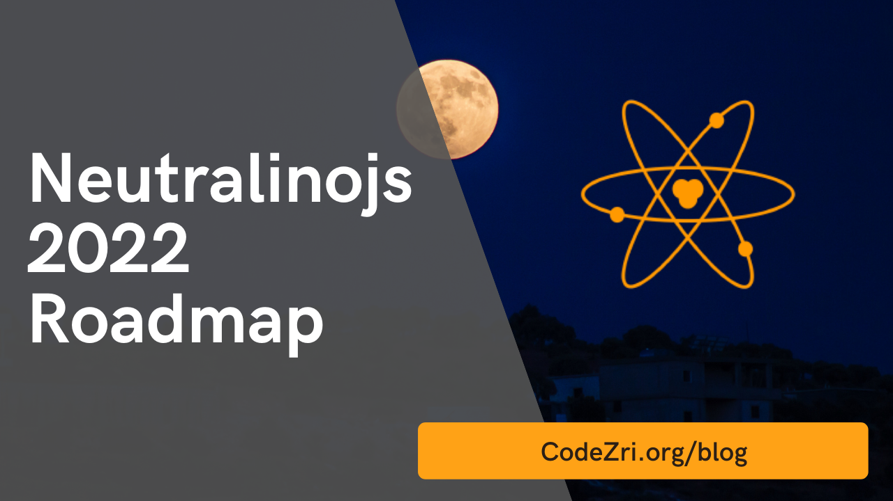

Every year, we typically publish a high-level view of planned milestones.
We wrote the ["Neutralinojs roadmap 2021"](https://factsoverflow.com/neutralinojs-2021-roadmap/)
article covering milestones for the year 2021.
The year 2021 roadmap focused on building an error code system, synchronizing features among
supported platforms, completing pending feature requests, and refactoring the main codebase with a
better structure. We are happy to announce that we achieved all the planned milestones and passed many
extra milestones.

<!--truncate-->

## Achievements in 2021

Here are some highlighted updates from 2021.

- We changed the native API communication from the synchronous HTTP RESTful approach to
asynchronous WebSocket-based communication.
- A lot of code refactoring happened. We re-structured the main codebase, JavaScript client API,
and created a detailed technical [contribution guide](https://neutralino.js.org/docs/contributing/framework-developer-guide/).
- We made all API functions asynchronous with Promises and implemented a complete
error-code system for handling errors.
- We added many features to the framework: auto-updater, extensions system, new configuration options,
new dialog boxes implementation, draggable regions, multi-window API, new global variables, API permission
system, new child process implementation, etc.
- We integrated a built-in events system for native, browser, and extension events.
- Now Neutralinojs has an automated DevOps workflow for releases thanks to the
[ReleaseZri](https://github.com/codezri/releasezri) project. Also, we added a C++ and JavaScript
integration [test suite](https://www.youtube.com/watch?v=DdlzDklYHVs).

2021 was a great year for Neutralinojs - we were able to make the framework and tools better with great
features and improvements.

## Community

There is always a great community behind every successful open-source project. Neutralinojs
community supported us to make the project better by submitting ideas, discussing new features,
and reporting bugs. Also, we met great code contributors around the world.

See the following community statistics.

- 4.7k+ stargazers on GitHub.
- 120 members on Discord.
- 248 members on Slack.
- 18k+ neu CLI downloads.

Neutralinojs got featured on many blog posts, articles, HackerNews threads, Reddit threads,
YouTube videos, newsletters, many websites, and worldwide Tweets. Also, we had an opportunity
to get featured on the [JavaScript Weekly](http://jsweekly.com/) newsletter several times. Some developers
built Neutralinojs app templates for various frontend frameworks.

Thank you so much, everyone.
We couldn't reach a wider developer audience without your support.

## Sponsors

We accept infrastructure and monetary donations.
Right now, we have one infrastructure sponsor and three financial donators.
[MacStadium](https://www.macstadium.com/) sponsored Neutralinojs by providing a free Mac Mini device.
Three Patreon users helped the maintainer to allocate more time for the project.

Thanks, MacStadium, and all patrons. If you would like to support us, consider becoming a [sponsor](/sponsors) -
or making a financial contribution via [Patreon](https://www.patreon.com/shalithasuranga).

## Roadmap of 2022

We changed the native API several times. But, now the API function interface is almost
stable and ready for production use-cases. Also, we recently added a way to write Neutralinojs
app backends with any programming language via the new extensions API. Therefore, in 2022, we are happy to see
some community projects/templates that let developers write Neutralinojs apps with Python, Go,
Node.js, Rust, and C#.
We recently added chrome mode to let Neutralinojs apps run as Chrome apps.
So, our first goal is to test it and make a new release.

Here is an overview of the 2022 roadmap.

- Improving the window mode by solving issues in the Neutralinojs's webview
- Implementing screen details and global keyboard shortcut API
- Updating the official documentation and creating more content for the developer community
- Completing feature requests and ideas submitted by the community

Check 2022 roadmap repo and suggest ideas: https://github.com/neutralinojs/roadmap

## Why we are building Neutralinojs
You may think why we are building another JavaScript framework. Electron dominates the desktop
application development industry. Even big tech companies tend to use Electron to build their desktop
apps. The Electron framework is a great tool for building **large-scale** desktop apps for **high-end**
computers. However, there is a problem if a simple desktop app takes hundred megabytes of disk space and consumes
above-average resources. Moreover, there is a problem if your app performs poorly on low-end or mid-end
computers.

Yes, there are many lightweight [alternatives](https://github.com/sudhakar3697/electron-alternatives#js)
for Electron already. However, Neutralinojs is a lightweight
alternative for Electron with unique features. You can run Neutralinojs-based desktop apps on Linux, macOS,
Windows, Web, and Chrome. We always strive to offer simple solutions for complex problems. For example,
we offer a minimal functional API without complicating the API with many OOP classes. Also, we provide a
minimal CLI to manage Neutralinojs apps. Neutralinojs indeed give you the freedom to extend the
native API with any programming language.

Neutralinojs has numerous use-cases. For example, you can use Neutralinojs cloud mode as a message broker
to integrate multiple processes. You can write Chrome apps or web apps with native features.
Neutralinojs is a framework to build, learn, experiment, and enjoy software development. See a
detailed comparison with other frameworks [here](https://github.com/Elanis/web-to-desktop-framework-comparison).

Build an app with Neutralinojs - feel the difference - and join with our journey.
